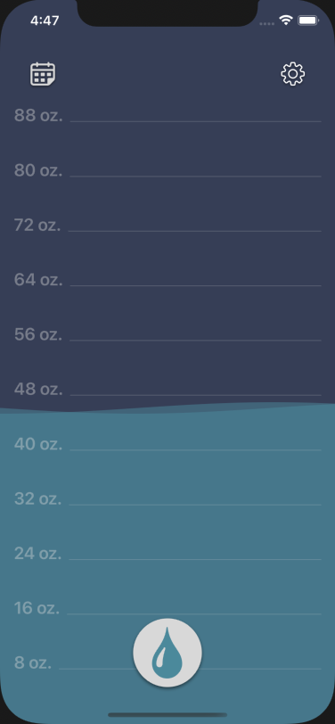
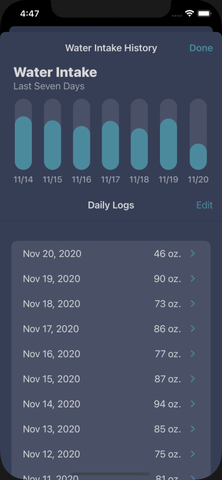
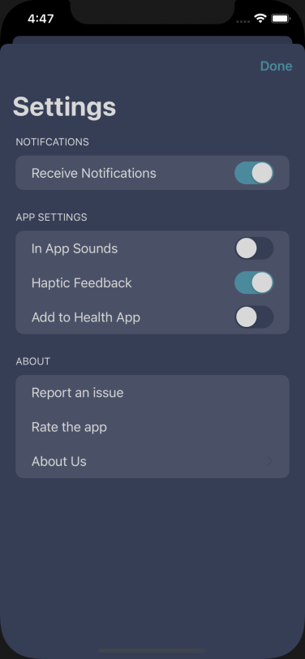

# Hydrate

---

Hydrate is a water intake tracker. Users can track exactly how much water they consume throughout the day. View your intake history and setup reminder notifications to drink water throughout the day.

## Contributors

- [David Wright](https://github.com/DavidWrightOS)
- [Josh Rutkowski](https://github.com/joshrutkowski)
- [Sal Amer](https://github.com/sal562)

# App Screenshots

## Codebase Overview

#### Languages
- Swift
- SwiftUI
- Objective-C

#### Frameworks
- UIKit
- CoreData
- HealthKit
- UserNotifications
- WatchOS Extension

## Features

- [x] Log water intake: short press button makes it easy to log by default value. Long press allows custom logging.
- [x] Settings page allows custom settings, app integrations
- [x] Current water level displayed on main page with custom wave-like animation
- [x] Integrate with watchOS to log quickly on the go
- [x] Integrate with HealthKit to export data to other apps
- [x] History page shows chart of intake levels
- [x] Reminders throughout the day

## Future

- [ ] Share results with friends
- [ ] Badge achievements (3-day streak, 7-day streak, etc)
- [ ] Interactive Chart
